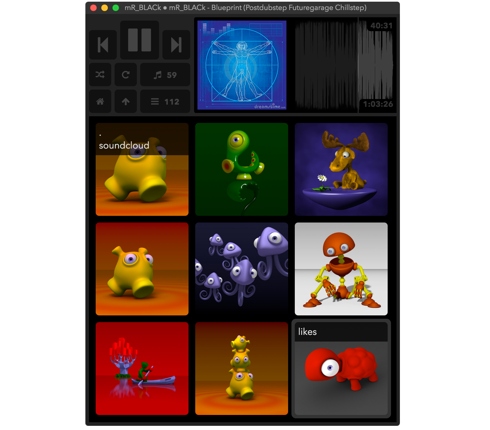

### about

krix is a simple [mpd](https://www.musicpd.org/)-client for macOS.

It ...
- lives in the menu bar
- handles mpd playlists
- includes a tile based file browser
- displays a waveform of the current song
- assumes your music files are located in '~/Music'
- caches tags, waveforms and images in '~/Music/.krix'

### setup

The music player daemon might by installed by:
```sh
brew install mpd
brew install mpc
# copy the default config file and adjust it to your needs:
cp /usr/local/etc/mpd/mpd.conf ~/.mpdconf 
```

These command-line tools are used for generating waveforms and converting cover images:
- [audiowaveform](https://github.com/bbc/audiowaveform) 
- [ffmpeg](http://ffmpeg.org/)
- [imagemagick](http://www.imagemagick.org/script/index.php)

You can install them like this:
```sh
brew tap bbc/audiowaveform
brew install audiowaveform
brew install imagemagick
brew install ffmpeg
```
