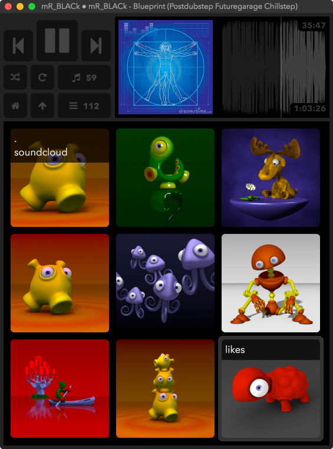

### wip

### todo

- remember expand 
- cache wave img
- apply folder cover to files

```sh
brew tap bbc/audiowaveform
brew install audiowaveform
```

```sh
brew install mpd
brew install mpc
cp /usr/local/etc/mpd/mpd.conf ~/.mpdconf
```
